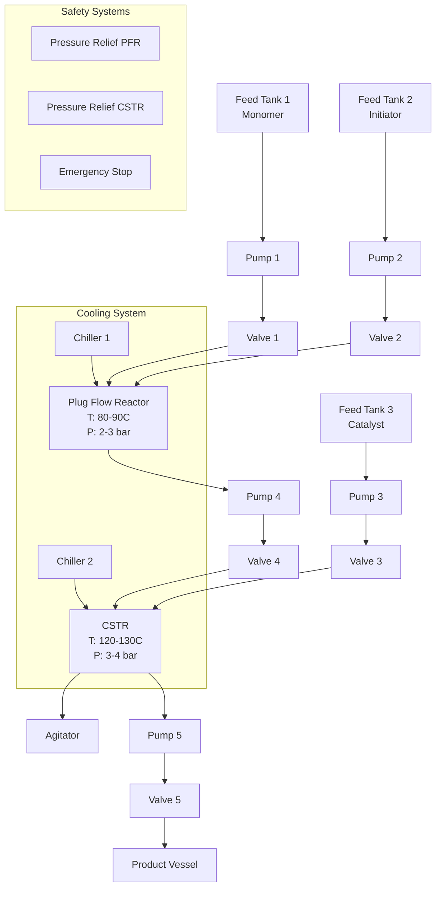
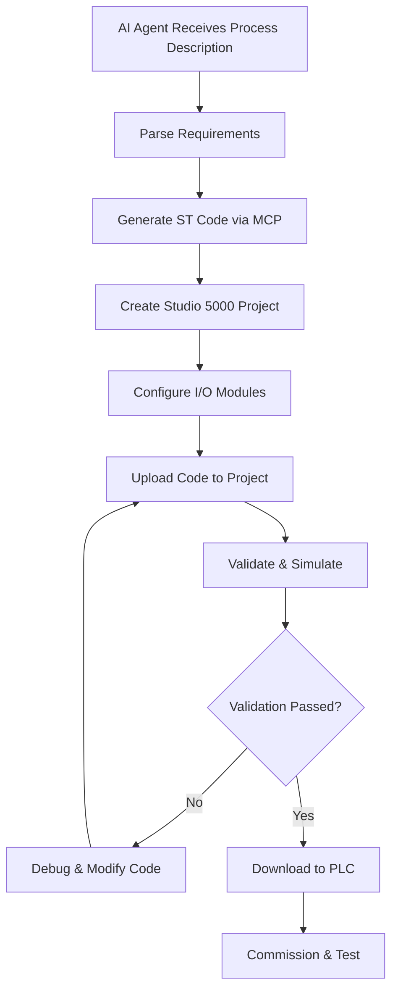

# Example Digital Twin.

## Introduction

This project is to evaluate building a digital twin for a chemical process
control system using Rockwell Automation's Studio 5000 and RSLogix 5000. The
goal is to create an AI agent that can automate the programming of PLCs for
complex chemical processes, including safety interlocks, alarms, and process
control logic.

## Real-World Chemical Process Example

### Process Description: Polymerization Reactor System

This example implements a complete polymerization reactor system where:
- **Feed Tank 1**: Contains monomer solution (styrene)
- **Feed Tank 2**: Contains initiator solution (benzoyl peroxide)
- **Plug Flow Reactor (PFR)**: Pre-reaction mixing and initial polymerization
- **Feed Tank 3**: Contains catalyst solution
- **CSTR**: Main polymerization reactor with temperature control
- **Product Vessel**: Final polymer collection with quality monitoring

### Process Flow Diagram (Mermaid)



### Complete Variable Declarations

```iecst
VAR
    // ============= PROCESS CONTROL =============
    StartProcess : BOOL := FALSE;
    StopProcess : BOOL := FALSE;
    EmergencyStop : BOOL := FALSE;
    ProcessRunning : BOOL := FALSE;
    ProcessStep : INT := 0;
    
    // ============= EQUIPMENT OUTPUTS =============
    // Pumps
    Pump_FT1_Monomer : BOOL := FALSE;
    Pump_FT2_Initiator : BOOL := FALSE;
    Pump_FT3_Catalyst : BOOL := FALSE;
    Pump_PFR_to_CSTR : BOOL := FALSE;
    Pump_CSTR_to_Product : BOOL := FALSE;
    
    // Control Valves (0-100% opening)
    Valve_FT1_Output : REAL := 0.0;
    Valve_FT2_Output : REAL := 0.0;
    Valve_FT3_Output : REAL := 0.0;
    Valve_PFR_to_CSTR_Output : REAL := 0.0;
    Valve_CSTR_to_Product_Output : REAL := 0.0;
    
    // On/Off Valves
    Valve_FT1_Isolation : BOOL := FALSE;
    Valve_FT2_Isolation : BOOL := FALSE;
    Valve_FT3_Isolation : BOOL := FALSE;
    
    // Agitators (Variable Speed 0-100%)
    Agitator_CSTR_Speed : REAL := 0.0;
    Agitator_CSTR_Enable : BOOL := FALSE;
    
    // Chillers
    Chiller_PFR_Enable : BOOL := FALSE;
    Chiller_CSTR_Enable : BOOL := FALSE;
    Chiller_PFR_Setpoint : REAL := 85.0;
    Chiller_CSTR_Setpoint : REAL := 125.0;
    
    // ============= ANALOG INPUTS =============
    // Level Sensors (0-100%)
    Level_FT1_Monomer : REAL;
    Level_FT2_Initiator : REAL;
    Level_FT3_Catalyst : REAL;
    Level_Product : REAL;
    
    // Temperature Sensors (°C)
    Temp_PFR_Inlet : REAL;
    Temp_PFR_Outlet : REAL;
    Temp_CSTR_Reactor : REAL;
    Temp_CSTR_Jacket : REAL;
    Temp_Product : REAL;
    
    // Pressure Sensors (bar)
    Pressure_PFR : REAL;
    Pressure_CSTR : REAL;
    Pressure_Product : REAL;
    
    // Flow Sensors (L/min)
    Flow_FT1_to_PFR : REAL;
    Flow_FT2_to_PFR : REAL;
    Flow_FT3_to_CSTR : REAL;
    Flow_PFR_to_CSTR : REAL;
    Flow_CSTR_to_Product : REAL;
    
    // Quality Measurements
    Viscosity_Product : REAL;
    Molecular_Weight : REAL;
    
    // ============= SETPOINTS AND LIMITS =============
    // Level Setpoints
    Level_Low_Critical : REAL := 5.0;
    Level_Low_Warning : REAL := 15.0;
    Level_High_Warning : REAL := 85.0;
    Level_High_Critical : REAL := 95.0;
    
    // Temperature Setpoints
    Temp_PFR_Min : REAL := 80.0;
    Temp_PFR_Max : REAL := 90.0;
    Temp_CSTR_Min : REAL := 120.0;
    Temp_CSTR_Max : REAL := 130.0;
    Temp_Critical_Max : REAL := 140.0;
    
    // Pressure Setpoints
    Pressure_PFR_Max : REAL := 3.0;
    Pressure_CSTR_Max : REAL := 4.0;
    Pressure_Critical_Max : REAL := 5.0;
    
    // Flow Setpoints
    Flow_Monomer_SP : REAL := 50.0;
    Flow_Initiator_SP : REAL := 5.0;
    Flow_Catalyst_SP : REAL := 2.0;
    
    // ============= PROCESS TIMERS =============
    Timer_Startup : TON;
    Timer_PFR_Residence : TON;
    Timer_CSTR_Reaction : TON;
    Timer_Cooldown : TON;
    Timer_Alarm_Delay : TON;
    
    // ============= ALARMS =============
    // Level Alarms
    Alarm_Level_FT1_Low : BOOL := FALSE;
    Alarm_Level_FT2_Low : BOOL := FALSE;
    Alarm_Level_FT3_Low : BOOL := FALSE;
    Alarm_Level_Product_High : BOOL := FALSE;
    
    // Temperature Alarms
    Alarm_Temp_PFR_High : BOOL := FALSE;
    Alarm_Temp_CSTR_High : BOOL := FALSE;
    Alarm_Temp_Critical : BOOL := FALSE;
    
    // Pressure Alarms
    Alarm_Pressure_PFR_High : BOOL := FALSE;
    Alarm_Pressure_CSTR_High : BOOL := FALSE;
    Alarm_Pressure_Critical : BOOL := FALSE;
    
    // Flow Alarms
    Alarm_Flow_Deviation : BOOL := FALSE;
    
    // Equipment Alarms
    Alarm_Pump_Fault : BOOL := FALSE;
    Alarm_Agitator_Fault : BOOL := FALSE;
    Alarm_Chiller_Fault : BOOL := FALSE;
    
    // ============= PID CONTROLLERS =============
    PID_Temp_PFR : PID;
    PID_Temp_CSTR : PID;
    PID_Flow_Monomer : PID;
    PID_Flow_Initiator : PID;
    PID_Flow_Catalyst : PID;
    
    // PID Parameters
    PID_Kp : REAL := 1.0;
    PID_Ki : REAL := 0.1;
    PID_Kd : REAL := 0.01;
    
    // ============= SAFETY INTERLOCKS =============
    Interlock_Active : BOOL := FALSE;
    Safety_OK_to_Start : BOOL := FALSE;
    Safety_Emergency_Shutdown : BOOL := FALSE;
    
END_VAR
```

### Main Process Control Logic (Structured Text)

```iecst
// ============= MAIN PROCESS CONTROL =============

// Safety and Emergency Stop Logic
IF EmergencyStop OR Safety_Emergency_Shutdown THEN
    ProcessStep := 999; // Emergency shutdown step
    StopProcess := TRUE;
    StartProcess := FALSE;
END_IF;

// Process State Machine
CASE ProcessStep OF
    0: // Idle State
        IF StartProcess AND Safety_OK_to_Start THEN
            ProcessStep := 10;
            Timer_Startup(IN:=TRUE, PT:=T#5s);
        END_IF;
        
    10: // Pre-startup Checks
        // Verify all levels are adequate
        IF (Level_FT1_Monomer > Level_Low_Warning) AND 
           (Level_FT2_Initiator > Level_Low_Warning) AND 
           (Level_FT3_Catalyst > Level_Low_Warning) AND 
           (Level_Product < Level_High_Warning) THEN
            ProcessStep := 20;
        ELSE
            ProcessStep := 900; // Fault condition
        END_IF;
        
    20: // Start Chillers
        Chiller_PFR_Enable := TRUE;
        Chiller_CSTR_Enable := TRUE;
        IF (Temp_PFR_Outlet < Temp_PFR_Max) AND 
           (Temp_CSTR_Reactor < Temp_CSTR_Max) THEN
            ProcessStep := 30;
            Timer_PFR_Residence(IN:=TRUE, PT:=T#10m);
        END_IF;
        
    30: // Start PFR Feeding
        Pump_FT1_Monomer := TRUE;
        Pump_FT2_Initiator := TRUE;
        Valve_FT1_Isolation := TRUE;
        Valve_FT2_Isolation := TRUE;
        
        // PID Control for flows
        PID_Flow_Monomer(
            PV := Flow_FT1_to_PFR,
            SP := Flow_Monomer_SP,
            Kp := PID_Kp,
            Ki := PID_Ki,
            Kd := PID_Kd
        );
        Valve_FT1_Output := PID_Flow_Monomer.CV;
        
        PID_Flow_Initiator(
            PV := Flow_FT2_to_PFR,
            SP := Flow_Initiator_SP,
            Kp := PID_Kp,
            Ki := PID_Ki,
            Kd := PID_Kd
        );
        Valve_FT2_Output := PID_Flow_Initiator.CV;
        
        IF Timer_PFR_Residence.Q THEN
            ProcessStep := 40;
            Timer_CSTR_Reaction(IN:=TRUE, PT:=T#2h);
        END_IF;
        
    40: // Start CSTR Operation
        Pump_PFR_to_CSTR := TRUE;
        Valve_PFR_to_CSTR_Output := 50.0; // 50% opening
        
        Pump_FT3_Catalyst := TRUE;
        Valve_FT3_Isolation := TRUE;
        
        PID_Flow_Catalyst(
            PV := Flow_FT3_to_CSTR,
            SP := Flow_Catalyst_SP,
            Kp := PID_Kp,
            Ki := PID_Ki,
            Kd := PID_Kd
        );
        Valve_FT3_Output := PID_Flow_Catalyst.CV;
        
        Agitator_CSTR_Enable := TRUE;
        Agitator_CSTR_Speed := 75.0; // 75% speed
        
        IF Timer_CSTR_Reaction.Q THEN
            ProcessStep := 50;
        END_IF;
        
    50: // Product Transfer
        Pump_CSTR_to_Product := TRUE;
        Valve_CSTR_to_Product_Output := 30.0; // Controlled transfer
        
        IF Level_Product > Level_High_Warning THEN
            ProcessStep := 60; // Batch complete
        END_IF;
        
    60: // Batch Complete - Cooldown
        // Stop feeding but continue agitation
        Pump_FT1_Monomer := FALSE;
        Pump_FT2_Initiator := FALSE;
        Pump_FT3_Catalyst := FALSE;
        Valve_FT1_Output := 0.0;
        Valve_FT2_Output := 0.0;
        Valve_FT3_Output := 0.0;
        
        Timer_Cooldown(IN:=TRUE, PT:=T#30m);
        IF Timer_Cooldown.Q THEN
            ProcessStep := 70;
        END_IF;
        
    70: // Shutdown Sequence
        Pump_PFR_to_CSTR := FALSE;
        Pump_CSTR_to_Product := FALSE;
        Agitator_CSTR_Enable := FALSE;
        Valve_PFR_to_CSTR_Output := 0.0;
        Valve_CSTR_to_Product_Output := 0.0;
        
        IF (Temp_PFR_Outlet < 50.0) AND (Temp_CSTR_Reactor < 50.0) THEN
            Chiller_PFR_Enable := FALSE;
            Chiller_CSTR_Enable := FALSE;
            ProcessStep := 0; // Return to idle
            ProcessRunning := FALSE;
        END_IF;
        
    900: // Fault State
        // Stop all equipment
        Pump_FT1_Monomer := FALSE;
        Pump_FT2_Initiator := FALSE;
        Pump_FT3_Catalyst := FALSE;
        Pump_PFR_to_CSTR := FALSE;
        Pump_CSTR_to_Product := FALSE;
        Agitator_CSTR_Enable := FALSE;
        
        IF NOT StartProcess THEN
            ProcessStep := 0; // Reset to idle when start is released
        END_IF;
        
    999: // Emergency Shutdown
        // Immediate stop all equipment
        Pump_FT1_Monomer := FALSE;
        Pump_FT2_Initiator := FALSE;
        Pump_FT3_Catalyst := FALSE;
        Pump_PFR_to_CSTR := FALSE;
        Pump_CSTR_to_Product := FALSE;
        Agitator_CSTR_Enable := FALSE;
        Valve_FT1_Isolation := FALSE;
        Valve_FT2_Isolation := FALSE;
        Valve_FT3_Isolation := FALSE;
        
        // Emergency cooling
        IF Temp_CSTR_Reactor > Temp_Critical_Max THEN
            Chiller_CSTR_Enable := TRUE;
            Chiller_CSTR_Setpoint := 80.0; // Emergency cooling
        END_IF;
        
END_CASE;

// ============= ALARM MONITORING =============

// Level Alarms with delay
Timer_Alarm_Delay(IN:=(Level_FT1_Monomer < Level_Low_Critical), PT:=T#5s);
Alarm_Level_FT1_Low := Timer_Alarm_Delay.Q;

Alarm_Level_FT2_Low := (Level_FT2_Initiator < Level_Low_Critical);
Alarm_Level_FT3_Low := (Level_FT3_Catalyst < Level_Low_Critical);
Alarm_Level_Product_High := (Level_Product > Level_High_Critical);

// Temperature Alarms
Alarm_Temp_PFR_High := (Temp_PFR_Outlet > Temp_PFR_Max);
Alarm_Temp_CSTR_High := (Temp_CSTR_Reactor > Temp_CSTR_Max);
Alarm_Temp_Critical := (Temp_PFR_Outlet > Temp_Critical_Max) OR 
                      (Temp_CSTR_Reactor > Temp_Critical_Max);

// Pressure Alarms
Alarm_Pressure_PFR_High := (Pressure_PFR > Pressure_PFR_Max);
Alarm_Pressure_CSTR_High := (Pressure_CSTR > Pressure_CSTR_Max);
Alarm_Pressure_Critical := (Pressure_PFR > Pressure_Critical_Max) OR 
                          (Pressure_CSTR > Pressure_Critical_Max);

// Flow Deviation Alarm
Alarm_Flow_Deviation := (ABS(Flow_FT1_to_PFR - Flow_Monomer_SP) > 10.0) OR
                       (ABS(Flow_FT2_to_PFR - Flow_Initiator_SP) > 2.0) OR
                       (ABS(Flow_FT3_to_CSTR - Flow_Catalyst_SP) > 1.0);

// ============= SAFETY INTERLOCKS =============

// Safety OK to Start Conditions
Safety_OK_to_Start := (Level_FT1_Monomer > Level_Low_Warning) AND
                     (Level_FT2_Initiator > Level_Low_Warning) AND
                     (Level_FT3_Catalyst > Level_Low_Warning) AND
                     (Level_Product < Level_High_Warning) AND
                     NOT Alarm_Temp_Critical AND
                     NOT Alarm_Pressure_Critical AND
                     NOT EmergencyStop;

// Emergency Shutdown Conditions
Safety_Emergency_Shutdown := Alarm_Temp_Critical OR
                            Alarm_Pressure_Critical OR
                            Alarm_Level_Product_High;

// Process Interlocks
IF Alarm_Level_FT1_Low OR Alarm_Level_FT2_Low THEN
    Pump_FT1_Monomer := FALSE;
    Pump_FT2_Initiator := FALSE;
    Valve_FT1_Output := 0.0;
    Valve_FT2_Output := 0.0;
END_IF;

IF Alarm_Level_FT3_Low THEN
    Pump_FT3_Catalyst := FALSE;
    Valve_FT3_Output := 0.0;
END_IF;

IF Alarm_Temp_PFR_High THEN
    Pump_PFR_to_CSTR := FALSE;
    Chiller_PFR_Setpoint := Chiller_PFR_Setpoint - 5.0; // Increase cooling
END_IF;

IF Alarm_Temp_CSTR_High THEN
    Pump_CSTR_to_Product := FALSE;
    Agitator_CSTR_Speed := MIN(Agitator_CSTR_Speed * 0.8, 100.0); // Reduce agitation
    Chiller_CSTR_Setpoint := Chiller_CSTR_Setpoint - 5.0; // Increase cooling
END_IF;

IF Alarm_Pressure_PFR_High THEN
    Valve_FT1_Output := Valve_FT1_Output * 0.8; // Reduce feed rate
    Valve_FT2_Output := Valve_FT2_Output * 0.8;
END_IF;

IF Alarm_Pressure_CSTR_High THEN
    Valve_CSTR_to_Product_Output := MIN(Valve_CSTR_to_Product_Output + 10.0, 100.0); // Increase discharge
END_IF;
```

### Ladder Logic Examples (Text Representation)

**Start/Stop Logic:**
```
|--[StartProcess]--[Safety_OK_to_Start]--[NOT StopProcess]--[NOT EmergencyStop]--(ProcessRunning)--|
|                                                                                                    |
|--[ProcessRunning]--[NOT StopProcess]--[NOT EmergencyStop]--[NOT Safety_Emergency_Shutdown]--------|
```

**Pump Control with Interlocks:**
```
|--[ProcessRunning]--[ProcessStep >= 30]--[NOT Alarm_Level_FT1_Low]--(Pump_FT1_Monomer)--|
|                                                                                          |
|--[ProcessRunning]--[ProcessStep >= 30]--[NOT Alarm_Level_FT2_Low]--(Pump_FT2_Initiator)--|
```

**Emergency Stop Logic:**
```
|--[EmergencyStop]--+--[Safety_Emergency_Shutdown]--+--[Alarm_Temp_Critical]--+--||
|                   |                               |                          |  ||
|                   +--[Alarm_Pressure_Critical]---+                          |  (Emergency_Active)
|                                                                              |  ||
+--[Alarm_Level_Product_High]-------------------------------------------------------+--||
```

### Function Block Programming

**Temperature Control Function Block (Text Description):**

```
FUNCTION_BLOCK FB_TempControl
VAR_INPUT
    Enable : BOOL;
    PV : REAL;        // Process Variable (actual temperature)
    SP : REAL;        // Setpoint
    ChillerFault : BOOL;
END_VAR

VAR_OUTPUT
    ChillerEnable : BOOL;
    ChillerSP : REAL;
    TempAlarm : BOOL;
END_VAR

VAR
    PID_Temp : PID;
    TempHigh : BOOL;
END_VAR

// Function Block Logic
IF Enable AND NOT ChillerFault THEN
    PID_Temp(PV := PV, SP := SP);
    ChillerEnable := TRUE;
    ChillerSP := PID_Temp.CV;
ELSE
    ChillerEnable := FALSE;
    ChillerSP := 0.0;
END_IF;

TempHigh := (PV > SP + 5.0);
TempAlarm := TempHigh OR ChillerFault;
```

### HMI Screen Layout (Text Description)

**Main Process Screen:**
```
+================================================+
|  POLYMERIZATION REACTOR CONTROL SYSTEM        |
+================================================+
| START | STOP | E-STOP |  Process Step: [  40] |
+================================================+
|                                                |
| FT1 [██████    ] 65%    PFR [███████   ] 85°C |
| FT2 [████████  ] 80%      ↓                   |
| FT3 [██████████] 95%    CSTR [████████  ] 125°C|
|                           ↓                   |
|                      PRODUCT [███     ] 35%   |
+================================================+
| ALARMS:                                        |
| [ ] Temp High PFR    [ ] Pressure High CSTR   |
| [ ] Level Low FT1    [X] Flow Deviation        |
+================================================+
```

### Deployment Instructions for Studio 5000

1. **Create New Project:**
   - Open Studio 5000 Logix Designer
   - Create new project with appropriate PLC model (e.g., ControlLogix 5580)
   - Configure communication modules (Ethernet/IP)

2. **Configure I/O:**
   - Add analog input modules for temperature, pressure, level, flow sensors
   - Add analog output modules for control valves and variable speed drives
   - Add digital output modules for pumps, isolation valves, chillers

3. **Create Program Structure:**
   - MainTask (continuous, 10ms scan)
   - SafetyTask (continuous, 5ms scan)
   - AlarmTask (periodic, 100ms scan)

4. **Import Code:**
   - Create Add-On Instructions (AOI) for PID controllers
   - Import structured text routines
   - Create ladder logic routines for safety interlocks
   - Configure function blocks for equipment control

5. **Configure Alarms:**
   - Set up alarm definitions in Controller Tags
   - Configure FactoryTalk View SE for HMI
   - Set alarm priorities and acknowledgment requirements

6. **Safety Considerations:**
   - Implement SIL-rated safety systems for emergency stops
   - Configure hardwired emergency stops independent of PLC
   - Test all safety interlocks before commissioning

7. **Testing and Validation:**
   - Simulate process in offline mode
   - Perform Factory Acceptance Testing (FAT)
   - Commission with actual equipment under controlled conditions
   - Validate all alarm and interlock functions

This comprehensive example provides a production-ready foundation for a chemical polymerization process control system with proper safety interlocks, alarm management, and process sequencing.


## AI Agent using MCP

### MCP Tools for PLC Programming
1. **Project Management**
   - `create_project()` - Initialize new Studio 5000 project
   - `configure_controller()` - Set PLC model and communication
   - `manage_tasks()` - Create MainTask, SafetyTask, etc.

2. **Code Generation**
   - `generate_structured_text()` - Convert AI descriptions to ST code
   - `create_ladder_logic()` - Generate ladder diagrams
   - `build_function_blocks()` - Create reusable FB libraries

3. **I/O Configuration**
   - `map_analog_inputs()` - Configure temperature, pressure sensors
   - `map_digital_outputs()` - Configure pumps, valves
   - `setup_ethernet_ip()` - Configure network modules

4. **Safety & Validation**
   - `validate_code()` - Check syntax and logic
   - `simulate_process()` - Test in RSLogix Emulate
   - `verify_interlocks()` - Validate safety systems

## Example AI Agent Workflow



## Challenges & Considerations

### Technical Challenges
1. **Proprietary APIs** - Limited public documentation for Studio 5000 automation
2. **Version Compatibility** - Different Studio 5000 versions have varying APIs
3. **Security** - Industrial systems require strict access controls
4. **Real-time Requirements** - PLC code must meet timing constraints

### Safety Concerns
1. **Code Validation** - AI-generated code must be thoroughly tested
2. **Emergency Stops** - Hardwired safety systems required
3. **Process Hazards** - Chemical processes need rigorous safety analysis
4. **Regulatory Compliance** - Must meet industry standards (IEC 61511, ISA-84)

### Licensing & Legal
1. **Rockwell Software Licensing** - Studio 5000 requires valid licenses
2. **Automation APIs** - May require developer agreements with Rockwell
3. **Liability** - AI-generated code in safety-critical applications

## Recommended Implementation Strategy

### Phase 1: Offline Development
- MCP server for L5X file generation
- Code validation and simulation
- Template-based project creation

### Phase 2: Studio 5000 Integration  
- COM automation for project management
- Automated I/O configuration
- Code upload and validation

### Phase 3: PLC Communication
- FactoryTalk Linx integration
- Remote download capabilities
- Real-time monitoring and diagnostics

### Phase 4: Safety & Validation
- Formal verification tools
- Safety interlock validation
- Compliance reporting

## Conclusion

While technically feasible, creating an AI agent for automatic Studio 5000 programming would require:

1. **Deep integration** with Rockwell's proprietary tools
2. **Extensive safety validation** for industrial applications  
3. **Regulatory compliance** for chemical process control
4. **Thorough testing** in simulation before deployment

The agent would be most valuable for **code generation and project setup**, with human oversight required for **safety validation and commissioning**.
